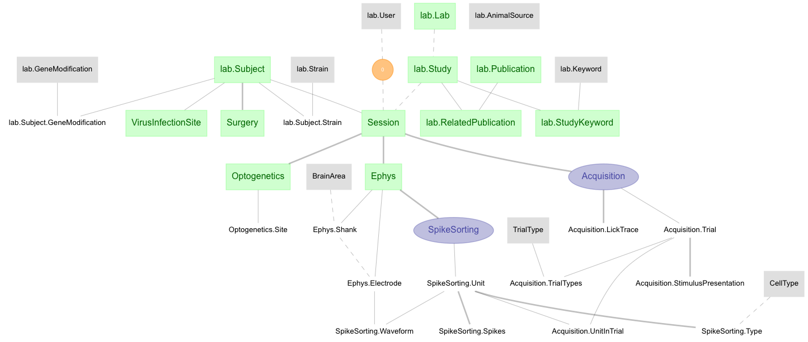

# ALM-1 

This pipeline is based on the study described in [Li, Nuo, et al. "Amotor cortex circuit for motor planning and movement." _Nature_ 519.7541 (2015): 51](https://www.ncbi.nlm.nih.gov/pubmed/25731172) with the data shared at  http://crcns.org/data-sets/motor-cortex/alm-1/

## Online viewing
All Jupyter notebooks in this catalog can be better viewed online through the Jupyter.org viewer at
http://nbviewer.jupyter.org/github/datajoint-catalog

## Obtain credentials
If you need a database account to try these examples, you can get a free tutorial account by subscribing through https://datajoint.io.

Before you start working with the pipeline, please obtain the following credentials:
* host address
* user name 
* password

E# Setup
The instructions for downloading the DataJoint library are available here: 
http://docs.datajoint.io/setup/Install-and-connect.html

## Support
Please submit issues and questions through the [Issues tab above](https://github.com/datajoint-catalog/djcat-ALM1/issues)

## The pipeline design 
The [ALM1-erd.ipynb] notebook plots the entity-relationships diagrams (ERDs) for the ALM1.
It comprises two schemas: `lab` for common elements across various studies and `alm1` for data specific to the ALM-1 study.

### Schema `lab`

### Schema `alm1`

### The entire pipeline

## Source Data for ingest 

Source data for this pipeline are available via CRCNS.org:
http://crcns.org/data-sets/motor-cortex/alm-1

Data downloads require an account registration; Details are provided here:
http://crcns.org/download

The example import scripts use the NWBv1 format files available within the datafiles/nwb_files subdirectory of the download area, and require the h5py library to be read.

More information concerning the NWB file format is available here:
https://github.com/NeurodataWithoutBorders/specification

With the h5py library available via pip (pip install h5py). More details concerning h5py are available here:
http://www.h5py.org/

The example export scripts are written using the NWB v1 API, available from:
https://github.com/NeurodataWithoutBorders/api-python

